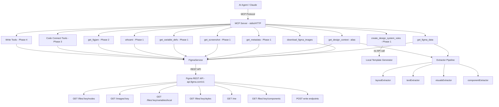

# Figma MCP Local Fork — Full Implementation Plan

**Date:** 2026-03-19  
**Scope:** Extending `figma-developer-mcp` / `Figma-Context-MCP-Extension` to implement all 13 official Figma MCP tools  
**Source of truth:** Official Figma MCP server at `https://mcp.figma.com/mcp` + steering files from `figma/mcp-server-guide`

---

## 1. Executive Summary

The official Figma MCP server exposes **13 tools**. A critical architectural finding confirmed through research:

> **All 13 tools are parameter-driven** — they accept `fileKey` + `nodeId` extracted from Figma URLs. None require a Figma plugin for selection context. All are, in principle, implementable in the local fork.

The local fork currently implements **2 tools** (`get_figma_data`, `download_figma_images`). This plan provides the complete roadmap to close the gap.

---

## 2. Current Local Fork Architecture

### 2.1 Transport Layer (`server.ts`)

- **stdio** — primary, for MCP clients (Claude Desktop, Cursor, etc.)
- **SSE** — legacy HTTP streaming
- **StreamableHTTP** — modern HTTP transport

### 2.2 Service Layer (`services/figma.ts`)

[`FigmaService`](src/services/figma.ts:25) wraps `https://api.figma.com/v1`. Auth via `X-Figma-Token` (PAT) or `Bearer` (OAuth).

**Currently used REST endpoints:**

| Method | Endpoint                                           | Purpose             |
| ------ | -------------------------------------------------- | ------------------- |
| `GET`  | `/files/:fileKey`                                  | Full file tree      |
| `GET`  | `/files/:fileKey/nodes?ids=:nodeId`                | Specific node data  |
| `GET`  | `/images/:fileKey?ids=:nodeIds&format=png&scale=2` | Render PNG          |
| `GET`  | `/images/:fileKey?ids=:nodeIds&format=svg`         | Render SVG          |
| `GET`  | `/files/:fileKey/images`                           | Image fill CDN URLs |

### 2.3 Extraction Pipeline (`extractors/`)

```
Raw Figma API Response
        ↓
simplifyRawFigmaObject()     ← design-extractor.ts
        ↓
extractFromDesign()          ← node-walker.ts (recursive tree traversal)
        ↓
allExtractors (4 built-ins)  ← built-in.ts
  ├── layoutExtractor        ← transformers/layout.ts
  ├── textExtractor          ← transformers/text.ts
  ├── visualsExtractor       ← transformers/style.ts + effects.ts
  └── componentExtractor     ← transformers/component.ts
        ↓
collapseSvgContainers()      ← afterChildren post-processing
        ↓
{ metadata, nodes, globalVars }  →  YAML or JSON
```

### 2.4 Tool Registration Pattern (`mcp/index.ts`)

Each tool follows this contract:

```typescript
{
  name: string,                    // MCP tool name
  description: string,             // shown to AI agents
  parametersSchema: ZodObject,     // input validation
  handler: async (params, service) => { content: [{ type, text }] }
}
```

Registered in [`registerTools()`](src/mcp/index.ts:37) via `server.registerTool()`.

### 2.5 Currently Implemented Tools

| Tool Name               | Description                                          | Key Endpoints                        |
| ----------------------- | ---------------------------------------------------- | ------------------------------------ |
| `get_figma_data`        | Full design data — layout, text, visuals, components | `/files/:key`, `/files/:key/nodes`   |
| `download_figma_images` | Download PNG/SVG images to local filesystem          | `/images/:key`, `/files/:key/images` |

---

## 3. Official Tool Inventory — All 13 Tools

### 3.1 Status Matrix

| #   | Tool                           | Plan               | REST Endpoint(s)                              | Local Status                        |
| --- | ------------------------------ | ------------------ | --------------------------------------------- | ----------------------------------- |
| 1   | `get_design_context`           | Any                | `GET /files/:key/nodes?ids=:id`               | ✅ Covered by `get_figma_data`      |
| 2   | `get_metadata`                 | Any                | `GET /files/:key/nodes?ids=:id` (sparse)      | ⚠️ Partial — wrong format           |
| 3   | `get_screenshot`               | Any                | `GET /images/:key?ids=:id&format=png`         | ⚠️ Partial — downloads to disk only |
| 4   | `get_variable_defs`            | Any                | `GET /files/:key/variables/local` + `/styles` | ❌ Not implemented                  |
| 5   | `whoami`                       | Any                | `GET /me`                                     | ❌ Not implemented                  |
| 6   | `create_design_system_rules`   | Any                | None (template generator)                     | ❌ Not implemented                  |
| 7   | `get_figjam`                   | Any                | `GET /files/:key` (FigJam type)               | ❌ Not implemented                  |
| 8   | `generate_figma_design`        | Any                | `POST` write API                              | ❌ Not implemented — write op       |
| 9   | `generate_diagram`             | Any                | `POST` FigJam write API                       | ❌ Not implemented — write op       |
| 10  | `get_code_connect_suggestions` | **Org/Enterprise** | `/files/:key/components` + Code Connect API   | ❌ Enterprise only                  |
| 11  | `send_code_connect_mappings`   | **Org/Enterprise** | `POST` Code Connect API                       | ❌ Enterprise + write               |
| 12  | `get_code_connect_map`         | **Org/Enterprise** | `GET` Code Connect API                        | ❌ Enterprise only                  |
| 13  | `add_code_connect_map`         | **Org/Enterprise** | `POST` Code Connect API                       | ❌ Enterprise + write               |

### 3.2 Detailed Tool Analysis

---

#### Tool 1: `get_design_context`

- **Official behavior**: Returns structured design data — layout, typography, colors, spacing — for a specific node. This is the primary tool used in the `implement-design.md` workflow (Step 2 of 7).
- **Parameters**: `fileKey: string`, `nodeId: string`
- **REST API**: `GET /v1/files/:fileKey/nodes?ids=:nodeId`
- **Local equivalent**: `get_figma_data` already calls this endpoint and processes through `allExtractors`
- **Gap**: The tool **name** differs. AI agents following official steering files call `get_design_context`, not `get_figma_data`. The output format may also differ (official returns more structured JSON vs local YAML/JSON tree).
- **Recommended action**: Add `get_design_context` as an **alias tool** that delegates to the same handler as `get_figma_data`, or rename the existing tool.

---

#### Tool 2: `get_metadata`

- **Official behavior**: Returns sparse XML with basic layer properties — names, types, IDs, bounding boxes. Used for lightweight discovery before fetching full design context.
- **Parameters**: `fileKey: string`, `nodeId: string`
- **REST API**: `GET /v1/files/:fileKey/nodes?ids=:nodeId` (same endpoint, `depth=2`)
- **Gap**: Output format is XML (not YAML/JSON). The local fork has no XML serializer.
- **Recommended action**: New tool `get_metadata` — calls same endpoint with `depth=2`, serializes the sparse layer tree to XML. Reuse [`getRawNode()`](src/services/figma.ts:283) with `depth=2`.

---

#### Tool 3: `get_screenshot`

- **Official behavior**: Returns a visual screenshot of a Figma node. The official MCP server fetches the PNG render URL and serves it at a `localhost` URL for the AI agent to reference.
- **Parameters**: `fileKey: string`, `nodeId: string`
- **REST API**: `GET /v1/images/:fileKey?ids=:nodeId&format=png&scale=2` → CDN URL → download image
- **Gap**: `download_figma_images` downloads to disk and returns file paths. `get_screenshot` should return the image **inline** (as a base64 data URI or MCP image content block) so the AI agent can visually inspect it.
- **Recommended action**: New tool `get_screenshot` — calls [`getNodeRenderUrls()`](src/services/figma.ts:106), downloads the PNG, returns it as an MCP `image` content block (`{ type: "image", data: base64, mimeType: "image/png" }`).

---

#### Tool 4: `get_variable_defs`

- **Official behavior**: Returns all variables and styles — color tokens, spacing scales, typography definitions — from a Figma file. Used to map Figma design tokens to project CSS variables/design system.
- **Parameters**: `fileKey: string`
- **REST API**:
  - `GET /v1/files/:fileKey/variables/local` — local variable collections and modes
  - `GET /v1/files/:fileKey/styles` — published styles (colors, text, effects, grids)
- **Gap**: Neither endpoint is currently called by the local fork.
- **Recommended action**: New tool `get_variable_defs` — calls both endpoints, merges results into a unified structure (variable collections + styles), returns YAML/JSON.
- **New `FigmaService` methods needed**:
  - `getVariables(fileKey: string)` → `GET /v1/files/:fileKey/variables/local`
  - `getStyles(fileKey: string)` → `GET /v1/files/:fileKey/styles`

---

#### Tool 5: `whoami`

- **Official behavior**: Returns the authenticated user's identity and Figma plan tier. Useful for verifying authentication and checking if Code Connect tools are available.
- **Parameters**: None
- **REST API**: `GET /v1/me`
- **Gap**: Endpoint not called anywhere in the local fork.
- **Recommended action**: New tool `whoami` — calls `GET /v1/me`, returns user info (name, email, plan). Trivial to implement.
- **New `FigmaService` method needed**:
  - `getMe()` → `GET /v1/me`

---

#### Tool 6: `create_design_system_rules`

- **Official behavior**: Takes `clientLanguages` and `clientFrameworks` parameters, returns a **template/guidance document** for generating project-specific design system rules. The AI then uses this template + codebase analysis to generate rules saved to `CLAUDE.md`.
- **Parameters**: `clientLanguages: string` (e.g., `"typescript,javascript"`), `clientFrameworks: string` (e.g., `"react"`, `"vue"`, `"svelte"`, `"angular"`, `"unknown"`)
- **REST API**: None — the official server returns a static/semi-static template. No Figma REST API call needed.
- **Gap**: Not implemented. This is a **scaffolding tool**, not a data-fetching tool.
- **Recommended action**: New tool `create_design_system_rules` — implemented as a **local template generator**. Takes `clientLanguages` + `clientFrameworks`, returns a markdown template covering: component organization, design token usage, Figma MCP integration flow, styling rules, asset handling, and project-specific conventions. No REST API call required.

---

#### Tool 7: `get_figjam`

- **Official behavior**: Converts a FigJam board (whiteboard/diagram file) to XML representation + screenshots of diagram elements.
- **Parameters**: `fileKey: string`, `nodeId?: string`
- **REST API**: `GET /v1/files/:fileKey` (same as regular Figma files, but the file type is `"FIGJAM"`)
- **Gap**: The local fork's `get_figma_data` could technically fetch FigJam files, but FigJam nodes have different types (STICKY, SHAPE_WITH_TEXT, CONNECTOR, etc.) that the current extractors don't handle.
- **Recommended action**: New tool `get_figjam` — calls [`getRawFile()`](src/services/figma.ts:270), detects FigJam node types, serializes to XML (similar to `get_metadata` format), includes screenshot URLs for diagram elements.

---

#### Tool 8: `generate_figma_design`

- **Official behavior**: Converts natural language UI descriptions into Figma design layers (write operation). Creates actual nodes in a Figma file.
- **Parameters**: `fileKey: string`, `nodeId: string`, `description: string`
- **REST API**: `POST /v1/files/:fileKey/nodes` or similar write endpoint
- **Gap**: Requires **write access** to the Figma API. The official server may also use a server-side AI model to translate descriptions to Figma node JSON. This is the most complex tool.
- **Recommended action**: **Defer to Phase 4**. Requires write API access + significant implementation effort. May depend on server-side AI that cannot be replicated locally.

---

#### Tool 9: `generate_diagram`

- **Official behavior**: Creates FigJam diagrams from Mermaid syntax (write operation). Converts Mermaid flowcharts/sequence diagrams into FigJam visual elements.
- **Parameters**: `fileKey: string`, `nodeId: string`, `mermaidSyntax: string`
- **REST API**: `POST` to FigJam write API
- **Gap**: Requires **write access** + Mermaid-to-FigJam node translation logic.
- **Recommended action**: **Defer to Phase 4**. Requires write API access + Mermaid parser integration.

---

#### Tool 10: `get_code_connect_suggestions`

- **Official behavior**: Scans a Figma file for published components that don't yet have Code Connect mappings. Returns component name, node ID, properties (JSON), and thumbnail image.
- **Parameters**: `fileKey: string`, `nodeId?: string`
- **REST API**: `GET /v1/files/:fileKey/components` + Code Connect API (undocumented/private)
- **Plan required**: **Org/Enterprise only**
- **Gap**: Requires Enterprise plan + Code Connect API access.
- **Recommended action**: **Defer to Phase 3**. Implement with plan-gating — return a clear error message if the user's plan doesn't support it (detectable via `whoami`).

---

#### Tool 11: `send_code_connect_mappings`

- **Official behavior**: Creates Code Connect mappings between Figma component node IDs and local code components. Write operation.
- **Parameters**: `fileKey: string`, `nodeId: string`, `mappings: Array<{nodeId, componentName, source, label}>`
- **REST API**: `POST` Code Connect API
- **Plan required**: **Org/Enterprise only**
- **Recommended action**: **Defer to Phase 3**.

---

#### Tool 12: `get_code_connect_map`

- **Official behavior**: Returns existing Code Connect mappings — maps Figma node IDs to code component paths and labels.
- **Parameters**: `fileKey: string`
- **REST API**: `GET` Code Connect API
- **Plan required**: **Org/Enterprise only**
- **Recommended action**: **Defer to Phase 3**.

---

#### Tool 13: `add_code_connect_map`

- **Official behavior**: Establishes new Figma-to-code mappings (similar to `send_code_connect_mappings` but for individual entries).
- **Parameters**: `fileKey: string`, `nodeId: string`, `componentPath: string`, `label: string`
- **REST API**: `POST` Code Connect API
- **Plan required**: **Org/Enterprise only**
- **Recommended action**: **Defer to Phase 3**.

---

## 4. REST API Endpoint Mapping

Complete map of all Figma REST API endpoints needed:

| Endpoint                           | Method   | Used By Tool(s)                                        | Already in `FigmaService`? |
| ---------------------------------- | -------- | ------------------------------------------------------ | -------------------------- |
| `/files/:key`                      | GET      | `get_figma_data`, `get_figjam`                         | ✅ `getRawFile()`          |
| `/files/:key/nodes?ids=:id`        | GET      | `get_figma_data`, `get_design_context`, `get_metadata` | ✅ `getRawNode()`          |
| `/images/:key?ids=:ids&format=png` | GET      | `download_figma_images`, `get_screenshot`              | ✅ `getNodeRenderUrls()`   |
| `/images/:key?ids=:ids&format=svg` | GET      | `download_figma_images`                                | ✅ `getNodeRenderUrls()`   |
| `/files/:key/images`               | GET      | `download_figma_images`                                | ✅ `getImageFillUrls()`    |
| `/files/:key/variables/local`      | GET      | `get_variable_defs`                                    | ❌ New method needed       |
| `/files/:key/styles`               | GET      | `get_variable_defs`                                    | ❌ New method needed       |
| `/me`                              | GET      | `whoami`                                               | ❌ New method needed       |
| `/files/:key/components`           | GET      | `get_code_connect_suggestions`                         | ❌ New method needed       |
| Code Connect API                   | GET/POST | Code Connect tools                                     | ❌ Undocumented/private    |
| Write API                          | POST     | `generate_figma_design`, `generate_diagram`            | ❌ Write access required   |

---

## 5. Implementation Roadmap

### Phase 1 — High Value, Low Complexity (Any Figma Plan)

These tools use existing or trivially new REST endpoints and deliver immediate value.

```
Priority  Tool                        Effort   New Endpoints
────────  ──────────────────────────  ───────  ─────────────────────────────
P1.1      whoami                      XS       GET /me
P1.2      get_design_context (alias)  XS       None (alias for get_figma_data)
P1.3      get_screenshot              S        None (reuse getNodeRenderUrls)
P1.4      get_variable_defs           M        GET /variables/local + /styles
P1.5      create_design_system_rules  M        None (local template)
P1.6      get_metadata                M        None (reuse getRawNode + XML)
```

### Phase 2 — Medium Value, Medium Complexity (Any Figma Plan)

```
Priority  Tool          Effort   Notes
────────  ────────────  ───────  ─────────────────────────────────────────
P2.1      get_figjam    M-L      FigJam node type handling + XML output
```

### Phase 3 — Enterprise Plan Required

```
Priority  Tool                          Effort   Notes
────────  ────────────────────────────  ───────  ─────────────────────────
P3.1      get_code_connect_suggestions  L        Org/Enterprise + private API
P3.2      get_code_connect_map          L        Org/Enterprise + private API
P3.3      send_code_connect_mappings    L        Org/Enterprise + write access
P3.4      add_code_connect_map          L        Org/Enterprise + write access
```

### Phase 4 — Write Operations (Complex, Any Plan)

```
Priority  Tool                    Effort   Notes
────────  ──────────────────────  ───────  ─────────────────────────────────
P4.1      generate_figma_design   XL       Write API + possible AI dependency
P4.2      generate_diagram        XL       Write API + Mermaid parser
```

---

## 6. Technical Specifications for Phase 1

### 6.1 `whoami` Tool

**New `FigmaService` method:**

```typescript
// services/figma.ts
async getMe(): Promise<{ id: string; email: string; handle: string; imgUrl: string }> {
  return this.request('/me');
}
```

**New tool file:** `src/mcp/tools/whoami-tool.ts`

```typescript
// Parameters: none
// Handler: calls figmaService.getMe(), returns YAML/JSON
// Tool name: "whoami"
```

---

### 6.2 `get_design_context` Alias

**Option A — Alias tool** (recommended for compatibility):

```typescript
// src/mcp/tools/get-design-context-tool.ts
// Same parametersSchema and handler as get_figma_data
// Tool name: "get_design_context"
// Description: matches official tool description
```

**Option B — Rename** `get_figma_data` to `get_design_context` (breaking change for existing users).

**Recommendation**: Add `get_design_context` as a second registration pointing to the same handler. Keep `get_figma_data` for backward compatibility.

---

### 6.3 `get_screenshot` Tool

**New `FigmaService` method:**

```typescript
// services/figma.ts
async getScreenshotBase64(fileKey: string, nodeId: string): Promise<string> {
  const urls = await this.getNodeRenderUrls(fileKey, [nodeId], 'png', { pngScale: 2 });
  const url = urls[nodeId];
  // fetch URL, convert to base64
  const response = await fetch(url);
  const buffer = await response.arrayBuffer();
  return Buffer.from(buffer).toString('base64');
}
```

**New tool file:** `src/mcp/tools/get-screenshot-tool.ts`

```typescript
// Parameters: fileKey, nodeId
// Handler: calls figmaService.getScreenshotBase64()
// Returns: { content: [{ type: "image", data: base64, mimeType: "image/png" }] }
// Tool name: "get_screenshot"
```

---

### 6.4 `get_variable_defs` Tool

**New `FigmaService` methods:**

```typescript
// services/figma.ts
async getLocalVariables(fileKey: string): Promise<GetLocalVariablesResponse> {
  return this.request(`/files/${fileKey}/variables/local`);
}

async getStyles(fileKey: string): Promise<GetFileStylesResponse> {
  return this.request(`/files/${fileKey}/styles`);
}
```

**New tool file:** `src/mcp/tools/get-variable-defs-tool.ts`

```typescript
// Parameters: fileKey
// Handler: calls both getLocalVariables() and getStyles(), merges results
// Returns: YAML/JSON with { variables: {...}, styles: {...} }
// Tool name: "get_variable_defs"
```

---

### 6.5 `create_design_system_rules` Tool

**No REST API call needed.** This tool is a **local template generator**.

**New tool file:** `src/mcp/tools/create-design-system-rules-tool.ts`

```typescript
// Parameters: clientLanguages: string, clientFrameworks: string
// Handler: returns a markdown template based on language/framework combination
// Template sections:
//   - Component Organization (paths, naming conventions)
//   - Design Tokens (CSS variables, no hardcoded hex)
//   - Figma MCP Integration Flow (get_design_context → get_screenshot → implement → validate)
//   - Styling Rules (framework-specific: Tailwind / CSS Modules / styled-components)
//   - Asset Handling (download_figma_images usage)
//   - Project-Specific Conventions (placeholder for user customization)
// Tool name: "create_design_system_rules"
```

**Framework-specific templates:**

- `react` + `typescript` → Tailwind/CSS Modules variant, JSX patterns
- `vue` → Vue SFC structure, `<script setup>`, scoped styles
- `svelte` → Svelte component structure, scoped styles
- `angular` → Angular component decorator, SCSS
- `unknown` → Generic template

---

### 6.6 `get_metadata` Tool

**New tool file:** `src/mcp/tools/get-metadata-tool.ts`

```typescript
// Parameters: fileKey, nodeId
// Handler: calls figmaService.getRawNode(fileKey, nodeId, depth=2)
// Serializes sparse layer tree to XML format:
//   <node id="1:2" type="FRAME" name="Card">
//     <node id="1:3" type="TEXT" name="Title" />
//   </node>
// Tool name: "get_metadata"
```

---

## 7. Architecture Changes Required

### 7.1 New Files to Create

```
src/mcp/tools/
  ├── whoami-tool.ts                    ← Phase 1.1
  ├── get-design-context-tool.ts        ← Phase 1.2 (alias)
  ├── get-screenshot-tool.ts            ← Phase 1.3
  ├── get-variable-defs-tool.ts         ← Phase 1.4
  ├── create-design-system-rules-tool.ts ← Phase 1.5
  ├── get-metadata-tool.ts              ← Phase 1.6
  └── get-figjam-tool.ts                ← Phase 2.1

src/utils/
  └── xml-serializer.ts                 ← shared XML output for get_metadata + get_figjam
```

### 7.2 Files to Modify

| File                                               | Change                                                                               |
| -------------------------------------------------- | ------------------------------------------------------------------------------------ |
| [`src/services/figma.ts`](src/services/figma.ts)   | Add `getMe()`, `getLocalVariables()`, `getStyles()`, `getScreenshotBase64()` methods |
| [`src/mcp/tools/index.ts`](src/mcp/tools/index.ts) | Export all new tools                                                                 |
| [`src/mcp/index.ts`](src/mcp/index.ts)             | Register all new tools in `registerTools()`                                          |
| [`src/config.ts`](src/config.ts)                   | No changes needed for Phase 1                                                        |

### 7.3 New Dependencies

| Package                                 | Purpose                                             | Phase                |
| --------------------------------------- | --------------------------------------------------- | -------------------- |
| None for Phase 1                        | XML serialization can be done with template strings | Phase 1              |
| `fast-xml-parser` or similar            | Robust XML output for `get_metadata` / `get_figjam` | Phase 1-2 (optional) |
| `mermaid` or `@mermaid-js/mermaid-core` | Mermaid parsing for `generate_diagram`              | Phase 4              |

### 7.4 `mcp/index.ts` Registration Pattern (Phase 1 additions)

```typescript
// New tools to register in registerTools():
server.registerTool('whoami', { ... }, (params) => whoamiTool.handler(params, figmaService));
server.registerTool('get_design_context', { ... }, (params) => getDesignContextTool.handler(params, figmaService, options.outputFormat));
server.registerTool('get_screenshot', { ... }, (params) => getScreenshotTool.handler(params, figmaService));
server.registerTool('get_variable_defs', { ... }, (params) => getVariableDefsTool.handler(params, figmaService, options.outputFormat));
server.registerTool('create_design_system_rules', { ... }, (params) => createDesignSystemRulesTool.handler(params));
server.registerTool('get_metadata', { ... }, (params) => getMetadataTool.handler(params, figmaService));
```

---

## 8. Limitations and Constraints

### 8.1 Enterprise-Only Tools (Phase 3)

The following tools require an **Org or Enterprise Figma plan**:

- `get_code_connect_suggestions`
- `send_code_connect_mappings`
- `get_code_connect_map`
- `add_code_connect_map`

**Detection**: Use `whoami` to check the user's plan tier before attempting Code Connect operations. Return a clear error message if the plan is insufficient.

**Code Connect API**: The Code Connect REST API endpoints are not fully documented in the public Figma REST API spec. They may require reverse-engineering from the official MCP server's behavior or from the `@figma/code-connect` npm package.

### 8.2 Write Operations (Phase 4)

`generate_figma_design` and `generate_diagram` require:

1. **Write access** — Figma Personal Access Tokens with write scope, or OAuth with `file_content:write`
2. **Server-side AI** — `generate_figma_design` likely uses a server-side model to translate natural language to Figma node JSON. This cannot be replicated locally without a separate AI call.
3. **Figma Plugin API parity** — Creating nodes via REST API has limitations compared to the Plugin API.

### 8.3 `create_design_system_rules` Fidelity

The official `create_design_system_rules` tool returns a template from the Figma MCP server. The local implementation will return a **locally-generated template** that approximates the official output. The template quality depends on how well the framework-specific variants are crafted.

### 8.4 `get_screenshot` Image Serving

The official MCP server serves screenshots at `localhost` URLs (e.g., `http://localhost:3333/images/...`). The local fork's `get_screenshot` will return the image as a **base64-encoded MCP image content block** instead. This is functionally equivalent for AI agents but differs in transport mechanism.

### 8.5 Node ID Format

Figma URLs use hyphens in node IDs (`node-id=1-2`), but the REST API expects colons (`1:2`). The local fork already handles this conversion in [`get-figma-data-tool.ts`](src/mcp/tools/get-figma-data-tool.ts:50). All new tools must apply the same normalization:

```typescript
const nodeId = rawNodeId?.replace(/-/g, ":");
```

---

## 9. System Architecture Diagram



---

## 10. Implementation Checklist

### Phase 1 — Ready to Implement

- [ ] **P1.1** Add `getMe()` to [`FigmaService`](src/services/figma.ts:25)
- [ ] **P1.1** Create [`src/mcp/tools/whoami-tool.ts`](src/mcp/tools/whoami-tool.ts)
- [ ] **P1.2** Create [`src/mcp/tools/get-design-context-tool.ts`](src/mcp/tools/get-design-context-tool.ts) (alias for `get_figma_data`)
- [ ] **P1.3** Add `getScreenshotBase64()` to [`FigmaService`](src/services/figma.ts:25)
- [ ] **P1.3** Create [`src/mcp/tools/get-screenshot-tool.ts`](src/mcp/tools/get-screenshot-tool.ts)
- [ ] **P1.4** Add `getLocalVariables()` and `getStyles()` to [`FigmaService`](src/services/figma.ts:25)
- [ ] **P1.4** Create [`src/mcp/tools/get-variable-defs-tool.ts`](src/mcp/tools/get-variable-defs-tool.ts)
- [ ] **P1.5** Create [`src/mcp/tools/create-design-system-rules-tool.ts`](src/mcp/tools/create-design-system-rules-tool.ts)
- [ ] **P1.6** Create [`src/utils/xml-serializer.ts`](src/utils/xml-serializer.ts)
- [ ] **P1.6** Create [`src/mcp/tools/get-metadata-tool.ts`](src/mcp/tools/get-metadata-tool.ts)
- [ ] **P1.x** Update [`src/mcp/tools/index.ts`](src/mcp/tools/index.ts) — export all new tools
- [ ] **P1.x** Update [`src/mcp/index.ts`](src/mcp/index.ts) — register all new tools

### Phase 2 — After Phase 1 Complete

- [ ] **P2.1** Create [`src/mcp/tools/get-figjam-tool.ts`](src/mcp/tools/get-figjam-tool.ts)

### Phase 3 — Enterprise Plan Required

- [ ] **P3.1** Research Code Connect API endpoints (reverse-engineer from `@figma/code-connect` package)
- [ ] **P3.2** Implement `get_code_connect_suggestions`
- [ ] **P3.3** Implement `get_code_connect_map`
- [ ] **P3.4** Implement `send_code_connect_mappings`
- [ ] **P3.5** Implement `add_code_connect_map`

### Phase 4 — Write Operations

- [ ] **P4.1** Research Figma write API endpoints and auth scopes
- [ ] **P4.2** Implement `generate_figma_design`
- [ ] **P4.3** Implement `generate_diagram`

---

## 11. Key References

| Resource                      | URL                                                      |
| ----------------------------- | -------------------------------------------------------- |
| Figma REST API Reference      | `https://www.figma.com/developers/api`                   |
| Official MCP Server           | `https://mcp.figma.com/mcp`                              |
| MCP Server Guide Repo         | `https://github.com/figma/mcp-server-guide`              |
| Steering: implement-design    | `figma-power/steering/implement-design.md`               |
| Steering: code-connect        | `figma-power/steering/code-connect-components.md`        |
| Steering: design-system-rules | `figma-power/steering/create-design-system-rules.md`     |
| `@figma/rest-api-spec`        | Already a dependency — use for response type definitions |
| `@figma/code-connect`         | Research for Code Connect API (Phase 3)                  |
