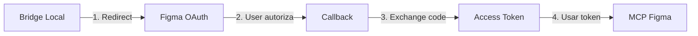

# Resultados da Investigação: MCP Oficial da Figma

**Data:** 2026-03-23  
**Endpoint testado:** `https://mcp.figma.com/mcp`

---

## 🔍 Descobertas Principais

### 1. ✅ Endpoint Existe e Está Ativo

O servidor responde corretamente ao OPTIONS request:
- **Status:** 200 OK
- **Métodos permitidos:** `GET, PUT, POST, DELETE, OPTIONS`
- **Headers CORS:** Configurados corretamente

### 2. ❌ Autenticação OAuth Obrigatória

**Descoberta crítica:** O endpoint requer **OAuth 2.0**, não Personal Access Token (PAT)!

```
Status: 401 Unauthorized
WWW-Authenticate: Bearer 
  resource_metadata="https://mcp.figma.com/.well-known/oauth-protected-resource"
  scope="mcp:connect"
  authorization_uri="https://api.figma.com/.well-known/oauth-authorization-server"
```

**Isso significa:**
- ❌ `FIGMA_API_KEY` (PAT) **NÃO funciona**
- ✅ Precisa de **OAuth token** com scope `mcp:connect`
- ✅ Precisa de **OAuth App** registrada na Figma

### 3. 🔒 Protocolo: HTTP POST (JSON-RPC 2.0)

- **Método:** POST (não SSE puro)
- **Formato:** JSON-RPC 2.0
- **Headers necessários:**
  - `Authorization: Bearer <oauth_token>`
  - `Content-Type: application/json`
  - `mcp-protocol-version` (opcional)

### 4. ❌ GET e SSE Não Suportados

- GET retorna: `405 Method Not Allowed`
- SSE (Server-Sent Events) não é o protocolo usado
- É HTTP POST com JSON-RPC

---

## 📋 Headers Importantes Descobertos

```http
access-control-allow-headers: Content-Type, X-Figma-Token, Authorization, mcp-protocol-version
access-control-allow-methods: GET,PUT,POST,DELETE,OPTIONS
access-control-allow-origin: *
vary: X-Figma-Token, Authorization
```

---

## 🚨 Problema Identificado

### O MCP Oficial Requer OAuth, Não PAT

**Situação atual:**
```
❌ Personal Access Token (PAT) → 401 Unauthorized
✅ OAuth Token com scope mcp:connect → Necessário
```

**Implicações:**
1. Não podemos usar o token simples do `.env`
2. Precisamos implementar fluxo OAuth completo
3. Usuário precisa autorizar a aplicação
4. Token OAuth tem expiração e refresh

---

## 🔧 Solução: Implementar OAuth Flow

### Opção A: OAuth Flow Completo (Recomendado)



**Passos necessários:**
1. Registrar OAuth App na Figma
2. Implementar servidor local para callback
3. Abrir browser para autorização
4. Receber código de autorização
5. Trocar por access token
6. Usar token para conectar no MCP

### Opção B: Usar Token OAuth Existente

Se você já tem um OAuth token:
```bash
# .env
FIGMA_OAUTH_TOKEN=seu_oauth_token_aqui
```

---

## 📝 Próximos Passos

### Fase 1: Obter OAuth Token ✅ PRIORIDADE

#### Método 1: Registrar OAuth App (Permanente)

1. Acesse: https://www.figma.com/developers/apps
2. Crie uma nova app
3. Configure:
   - **Redirect URI:** `http://localhost:3000/callback`
   - **Scopes:** `mcp:connect`
4. Anote:
   - `CLIENT_ID`
   - `CLIENT_SECRET`

#### Método 2: Usar OAuth App Existente

Você já tem no `.env`:
```
FIGMA_CLIENT_ID=cJBp89tNZ6hdz1QnMVUCAV
FIGMA_CLIENT_SECRET=dhLaN9U87y2dPqaUGdIdSwVotLDF37
```

**Ação:** Verificar se essa app tem o scope `mcp:connect`

### Fase 2: Implementar OAuth Flow

Criar script para obter token:

```typescript
// oauth-flow.ts
import express from 'express';

const app = express();
const CLIENT_ID = process.env.FIGMA_CLIENT_ID;
const CLIENT_SECRET = process.env.FIGMA_CLIENT_SECRET;
const REDIRECT_URI = 'http://localhost:3000/callback';

// 1. Redirecionar para autorização
app.get('/auth', (req, res) => {
  const authUrl = `https://www.figma.com/oauth?` +
    `client_id=${CLIENT_ID}&` +
    `redirect_uri=${REDIRECT_URI}&` +
    `scope=mcp:connect&` +
    `response_type=code`;
  
  res.redirect(authUrl);
});

// 2. Receber callback
app.get('/callback', async (req, res) => {
  const code = req.query.code;
  
  // 3. Trocar código por token
  const response = await fetch('https://www.figma.com/api/oauth/token', {
    method: 'POST',
    headers: { 'Content-Type': 'application/json' },
    body: JSON.stringify({
      client_id: CLIENT_ID,
      client_secret: CLIENT_SECRET,
      redirect_uri: REDIRECT_URI,
      code: code,
      grant_type: 'authorization_code'
    })
  });
  
  const data = await response.json();
  console.log('OAuth Token:', data.access_token);
  
  res.send('Token obtido! Verifique o console.');
});

app.listen(3000);
```

### Fase 3: Testar Conexão com OAuth Token

Após obter o token, atualizar o teste:

```typescript
const OAUTH_TOKEN = process.env.FIGMA_OAUTH_TOKEN;

const response = await fetch('https://mcp.figma.com/mcp', {
  method: 'POST',
  headers: {
    'Authorization': `Bearer ${OAUTH_TOKEN}`,
    'Content-Type': 'application/json'
  },
  body: JSON.stringify({
    jsonrpc: '2.0',
    method: 'initialize',
    params: {
      protocolVersion: '2024-11-05',
      capabilities: {},
      clientInfo: {
        name: 'figma-mcp-bridge',
        version: '1.0.0'
      }
    },
    id: 1
  })
});
```

---

## 🎯 Decisão Arquitetural

### Arquitetura Revisada do Bridge

```
AI Cockpit (stdio)
    ↓
Bridge Local (Node.js)
    ↓ [OAuth Token]
    ↓ [HTTP POST + JSON-RPC]
MCP Figma Oficial
```

**Componentes necessários:**
1. ✅ Servidor stdio (para AI Cockpit)
2. ✅ Cliente HTTP POST (não SSE)
3. ✅ OAuth flow (para obter token)
4. ✅ Token refresh (OAuth tokens expiram)
5. ✅ Proxy JSON-RPC (mapear chamadas)

---

## ⚠️ Limitações Identificadas

### 1. OAuth Requer Interação do Usuário

- Não é possível usar PAT simples
- Usuário precisa autorizar no browser
- Token expira e precisa refresh

### 2. Complexidade Aumentada

- Bridge precisa gerenciar OAuth flow
- Precisa servidor local para callback
- Precisa armazenar e renovar tokens

### 3. Alternativa: Continuar com Fork Atual

**Prós do fork atual:**
- ✅ Usa PAT simples (sem OAuth)
- ✅ Sem interação do usuário
- ✅ Funciona offline (após primeira chamada)
- ✅ Controle total do código

**Contras do fork atual:**
- ❌ Não tem write operations
- ❌ Não tem Code Connect
- ❌ Precisa reimplementar features

---

## 💡 Recomendação Final

### Cenário 1: Você Precisa de Write Operations

**Implemente o Bridge com OAuth:**
- Esforço: Alto (2-3 semanas)
- Complexidade: Alta
- Benefício: Acesso a TODAS as features

### Cenário 2: Você Só Precisa de Read Operations

**Continue com o fork atual:**
- Esforço: Zero (já está pronto)
- Complexidade: Baixa
- Benefício: Funciona agora, sem OAuth

### Cenário 3: Você Quer o Melhor dos Dois Mundos

**Hybrid Bridge:**
- Read operations: Fork local (PAT)
- Write operations: MCP oficial (OAuth)
- Complexidade: Média
- Benefício: Flexibilidade máxima

---

## 📊 Comparação Atualizada

| Aspecto | Fork Atual | Bridge OAuth | Hybrid |
|---------|-----------|--------------|--------|
| **Autenticação** | PAT (simples) | OAuth (complexo) | Ambos |
| **Setup** | Imediato | 2-3 semanas | 1-2 semanas |
| **Read ops** | ✅ 9 tools | ✅ 13 tools | ✅ 9 tools |
| **Write ops** | ❌ | ✅ | ✅ |
| **Code Connect** | ❌ | ✅ | ✅ |
| **Offline** | ✅ | ❌ | ✅ (read) |
| **Manutenção** | Média | Baixa | Média |

---

## 🚀 Ação Imediata Recomendada

1. **Decidir:** Você realmente precisa de write operations?
   
2. **Se SIM:**
   - Implementar OAuth flow
   - Registrar OAuth app
   - Criar bridge com OAuth
   
3. **Se NÃO:**
   - Continuar com fork atual
   - Focar em melhorar features existentes
   - Economizar 2-3 semanas de desenvolvimento

---

**Conclusão:** O MCP oficial da Figma é **tecnicamente viável**, mas requer **OAuth 2.0** ao invés de PAT, aumentando significativamente a complexidade da implementação.