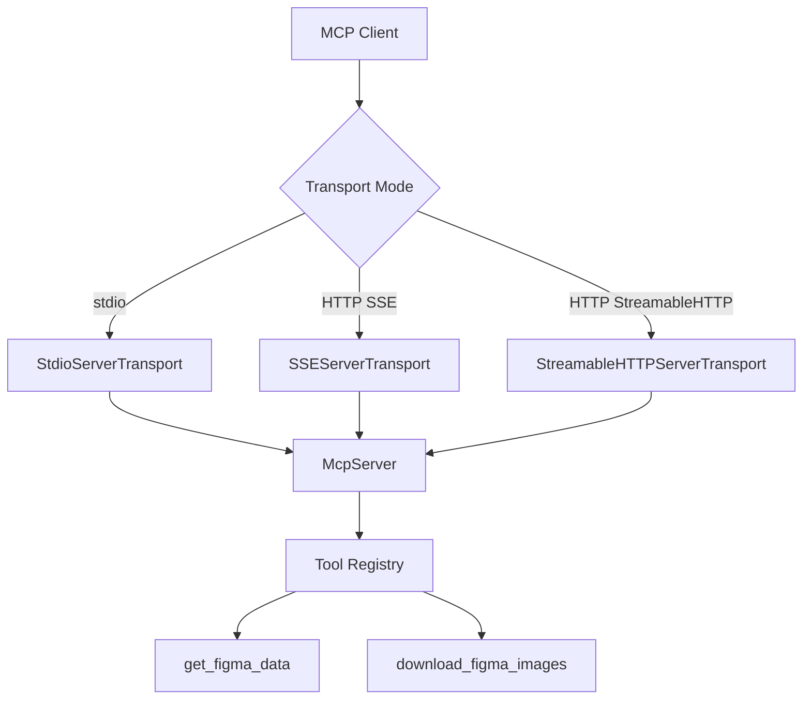
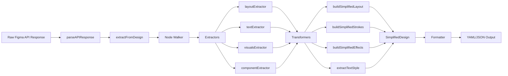
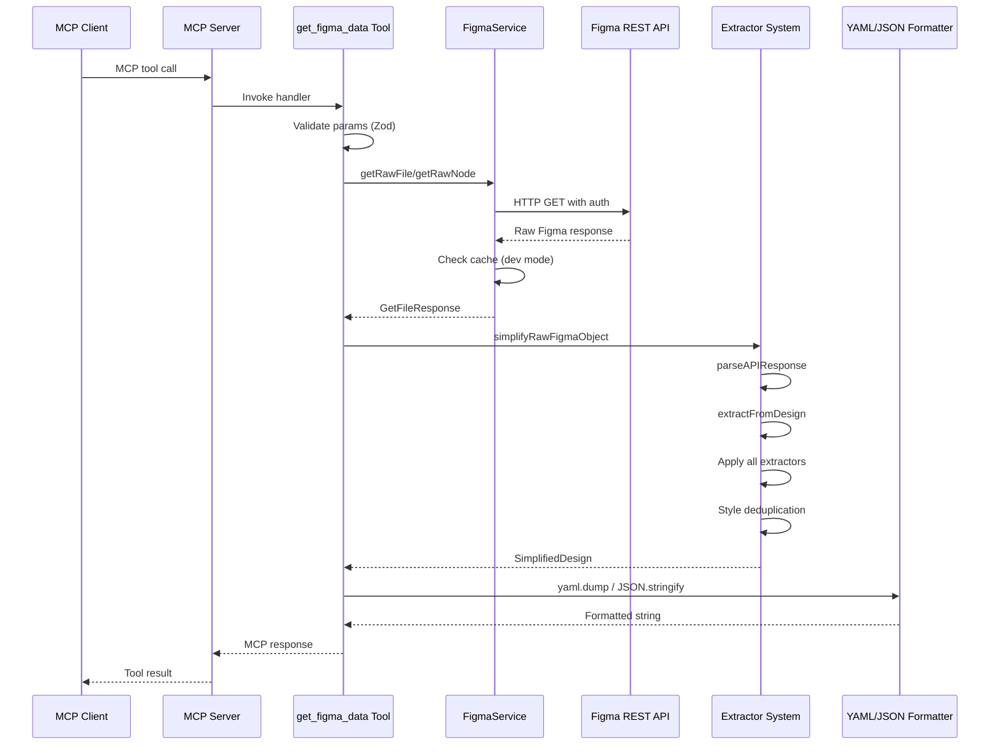
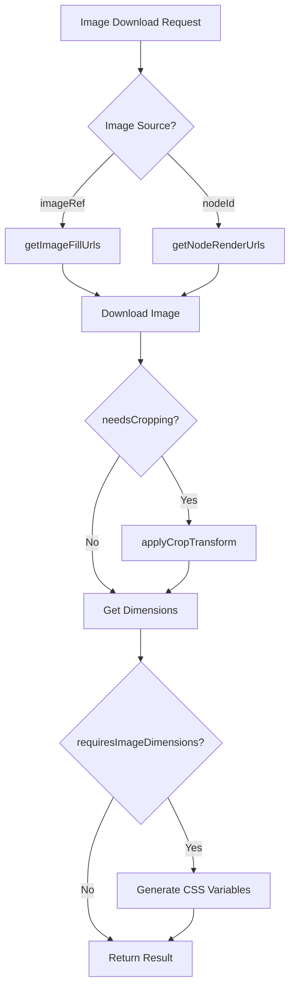
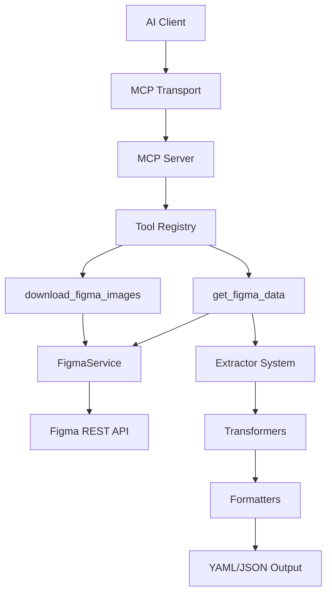
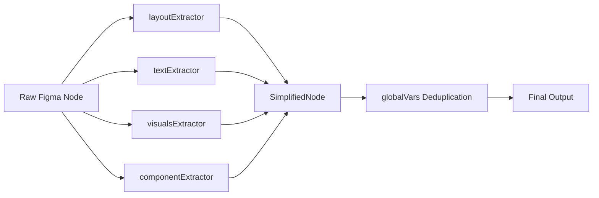

# Technical Analysis: Figma-Context-MCP-Extension v2

**Project:** Framelink MCP for Figma (`figma-developer-mcp`)
**Version:** 0.6.6
**Purpose:** Model Context Protocol server providing AI coding agents access to Figma design data
**Repository:** https://github.com/GLips/Figma-Context-MCP
**Last Updated:** 2026-03-19

---

## Table of Contents

1. [Architecture & Core Mechanics](#1-architecture--core-mechanics)
2. [Implementation Patterns](#2-implementation-patterns)
3. [Data Flow & Processing](#3-data-flow--processing)
4. [Testing Strategy](#4-testing-strategy)
5. [Performance & Optimization](#5-performance--optimization)
6. [Security & Configuration](#6-security--configuration)
7. [Development Guidelines](#7-development-guidelines)
8. [Quick Reference](#8-quick-reference)

---

## 1. Architecture & Core Mechanics

### 1.1 MCP Server Implementation

The project implements a **Model Context Protocol (MCP) server** that exposes Figma design data to AI coding assistants. The server supports three transport mechanisms:

#### Transport Architecture



**1. stdio Transport** ([`src/server.ts:31-34`](src/server.ts))

- Activated via `--stdio` CLI flag or `NODE_ENV=cli`
- Uses stdin/stdout for communication
- Ideal for direct MCP client integration (Cursor, Claude Desktop)
- Logger writes to stderr to avoid protocol corruption

**2. SSE (Server-Sent Events) Transport** ([`src/server.ts:174-198`](src/server.ts))

- Legacy HTTP transport
- Endpoints: `GET /sse` (establish connection), `POST /messages` (send messages)
- Session-based communication
- Supports long-lived connections

**3. StreamableHTTP Transport** ([`src/server.ts:62-145`](src/server.ts))

- Modern HTTP transport
- Endpoint: `POST/GET/DELETE /mcp`
- Session management via `mcp-session-id` header
- Supports progress notifications

#### Known Limitation

**Single Transport Per Server Instance:** SDK 1.21+ enforces that a single `McpServer` instance can only serve one transport at a time. Attempting to connect a second transport throws an error. This is documented in [`src/tests/server.test.ts:162`](src/tests/server.test.ts) with `it.fails()`.

### 1.2 Tool Registration System

The server exposes **two MCP tools** registered in [`src/mcp/index.ts:37-68`](src/mcp/index.ts):

#### Tool 1: `get_figma_data`

**Purpose:** Fetch and simplify Figma design data

**Parameters (Zod-validated):**

```typescript
{
  fileKey: string,      // Alphanumeric file key (required)
  nodeId?: string,      // Node ID in "1234:5678" format (optional)
  depth?: number        // Traversal depth limit (optional, use sparingly)
}
```

**Implementation:** [`src/mcp/tools/get-figma-data-tool.ts`](src/mcp/tools/get-figma-data-tool.ts)

**Output Format:** YAML (default) or JSON

```yaml
metadata:
  name: "Design File Name"
nodes:
  - id: "1:2"
    name: "Button"
    type: "FRAME"
    layout: "layout_ABC123"
    fills: "fill_DEF456"
globalVars:
  styles:
    layout_ABC123: { mode: "row", gap: "8px" }
    fill_DEF456: ["#007AFF"]
```

#### Tool 2: `download_figma_images`

**Purpose:** Download PNG/SVG images from Figma with post-processing

**Parameters:**

```typescript
{
  fileKey: string,
  nodes: Array<{
    nodeId: string,
    imageRef?: string,
    fileName: string,
    needsCropping?: boolean,
    cropTransform?: Transform,
    requiresImageDimensions?: boolean,
    filenameSuffix?: string
  }>,
  localPath: string,
  pngScale?: number  // Default: 2
}
```

**Implementation:** [`src/mcp/tools/download-figma-images-tool.ts`](src/mcp/tools/download-figma-images-tool.ts)

**Features:**

- Deduplicates identical image downloads
- Applies crop transforms using Sharp
- Extracts image dimensions for CSS variables
- Path traversal protection

### 1.3 Configuration Management

Configuration follows a **priority chain**: CLI flag → Environment Variable → Default

#### Configuration Resolution

**Implementation:** [`src/config.ts:54-178`](src/config.ts)

```typescript
function resolve<T>(flag: T | undefined, env: T | undefined, fallback: T): Resolved<T> {
  if (flag !== undefined) return { value: flag, source: "cli" };
  if (env !== undefined) return { value: env, source: "env" };
  return { value: fallback, source: "default" };
}
```

#### Configuration Options

| Option         | CLI Flag                 | Environment Variable       | Default     |
| -------------- | ------------------------ | -------------------------- | ----------- |
| Figma API Key  | `--figma-api-key`        | `FIGMA_API_KEY`            | (required)  |
| OAuth Token    | `--figma-oauth-token`    | `FIGMA_OAUTH_TOKEN`        | —           |
| Server Port    | `--port`                 | `FRAMELINK_PORT` or `PORT` | `3333`      |
| Server Host    | `--host`                 | `FRAMELINK_HOST`           | `127.0.0.1` |
| Output Format  | `--json`                 | `OUTPUT_FORMAT`            | `yaml`      |
| Skip Images    | `--skip-image-downloads` | `SKIP_IMAGE_DOWNLOADS`     | `false`     |
| Custom .env    | `--env`                  | —                          | `./.env`    |
| Transport Mode | `--stdio`                | `NODE_ENV=cli`             | HTTP        |

#### Authentication Methods

**1. Personal Access Token (PAT):**

```bash
--figma-api-key=figd_xxxxx
```

Uses `X-Figma-Token` header

**2. OAuth Bearer Token:**

```bash
--figma-oauth-token=xxxxx
```

Uses `Authorization: Bearer` header

### 1.4 Modular Extractor/Transformer Pipeline

The data processing pipeline is highly modular and composable:



#### Pipeline Stages

**Stage 1: API Response Parsing** ([`src/extractors/design-extractor.ts:48-90`](src/extractors/design-extractor.ts))

- Normalizes `GetFileResponse` and `GetFileNodesResponse` into common shape
- Extracts components, componentSets, styles
- Filters visible nodes

**Stage 2: Node Extraction** ([`src/extractors/node-walker.ts:21-41`](src/extractors/node-walker.ts))

- Single-pass recursive tree traversal
- Applies all extractors to each node
- Manages global variables for style deduplication

**Stage 3: Transformation** ([`src/transformers/`](src/transformers/))

- Converts Figma-specific properties to CSS-like values
- Handles layout, colors, typography, effects

**Stage 4: Formatting** ([`src/mcp/tools/get-figma-data-tool.ts:88-89`](src/mcp/tools/get-figma-data-tool.ts))

- Serializes to YAML or JSON
- Optimizes for token efficiency

---

## 2. Implementation Patterns

### 2.1 Extractor System

The extractor system implements the **Strategy Pattern** with composable functions.

#### Base Extractor Interface

**Type Definition:** [`src/extractors/types.ts:56-60`](src/extractors/types.ts)

```typescript
export type ExtractorFn = (
  node: FigmaDocumentNode,
  result: SimplifiedNode,
  context: TraversalContext,
) => void;
```

**Key Characteristics:**

- **Mutates** the `result` object in place (performance optimization)
- Receives full `context` including `globalVars` and `parent` node
- Pure side effects (no return value)
- Composable via arrays

#### Specialized Extractors

**1. Layout Extractor** ([`src/extractors/built-in.ts:44-49`](src/extractors/built-in.ts))

```typescript
export const layoutExtractor: ExtractorFn = (node, result, context) => {
  const layout = buildSimplifiedLayout(node, context.parent);
  if (Object.keys(layout).length > 1) {
    result.layout = findOrCreateVar(context.globalVars, layout, "layout");
  }
};
```

**Handles:**

- Auto Layout (flex-like) properties
- Absolute positioning
- Dimensions (width, height, aspect ratio)
- Padding, gap, alignment
- Overflow scrolling

**2. Text Extractor** ([`src/extractors/built-in.ts:54-74`](src/extractors/built-in.ts))

**Handles:**

- Text content (`characters` property)
- Font family, weight, size
- Line height, letter spacing
- Text alignment (horizontal, vertical)
- Text case transformations

**3. Visuals Extractor** ([`src/extractors/built-in.ts:79-137`](src/extractors/built-in.ts))

**Handles:**

- Fills (solid colors, gradients, images, patterns)
- Strokes (colors, weights, dashes)
- Effects (shadows, blurs)
- Opacity
- Border radius (uniform and per-corner)

**4. Component Extractor** ([`src/extractors/built-in.ts:142-159`](src/extractors/built-in.ts))

**Handles:**

- Component ID references
- Component properties (variants, boolean props, text overrides)

#### Extractor Composition

**Predefined Combinations:** [`src/extractors/built-in.ts:184-204`](src/extractors/built-in.ts)

```typescript
// All extractors - full extraction
export const allExtractors = [layoutExtractor, textExtractor, visualsExtractor, componentExtractor];

// Layout and text only - content analysis
export const layoutAndText = [layoutExtractor, textExtractor];

// Text content only - copy extraction
export const contentOnly = [textExtractor];

// Visuals only - design system analysis
export const visualsOnly = [visualsExtractor];

// Layout only - structure analysis
export const layoutOnly = [layoutExtractor];
```

### 2.2 Transformer Chain Architecture

Transformers are **pure functions** that convert Figma-specific data structures into simplified, CSS-like representations.

#### Layout Transformer

**Implementation:** [`src/transformers/layout.ts`](src/transformers/layout.ts)

**Key Function:** `buildSimplifiedLayout(node, parent)`

**Converts:**

- Figma Auto Layout → CSS Flexbox-like schema
- `layoutMode: "HORIZONTAL"` → `mode: "row"`
- `layoutMode: "VERTICAL"` → `mode: "column"`
- `primaryAxisAlignItems` → `justifyContent`
- `counterAxisAlignItems` → `alignItems`

**Output Type:**

```typescript
interface SimplifiedLayout {
  mode: "none" | "row" | "column";
  justifyContent?: "flex-start" | "flex-end" | "center" | "space-between";
  alignItems?: "flex-start" | "flex-end" | "center" | "stretch";
  gap?: string;
  padding?: string;
  dimensions?: { width?: number; height?: number };
  position?: "absolute";
}
```

#### Color/Style Transformer

**Implementation:** [`src/transformers/style.ts`](src/transformers/style.ts)

**Key Functions:**

- `parsePaint(paint, hasChildren)` - Converts Figma Paint to SimplifiedFill
- `convertColor(rgba, opacity)` - RGBA → hex + opacity
- `formatRGBAColor(rgba, opacity)` - RGBA → CSS rgba() string
- `convertGradientToCss(gradient)` - Figma gradient → CSS gradient

**Handles:**

- **Solid Colors:** `#RRGGBB` or `rgba(r, g, b, a)`
- **Gradients:** Linear, radial, angular, diamond
- **Images:** Background images with scale modes
- **Patterns:** Repeating patterns with alignment

#### Text Transformer

**Implementation:** [`src/transformers/text.ts`](src/transformers/text.ts)

**Output Type:**

```typescript
export type SimplifiedTextStyle = Partial<{
  fontFamily: string;
  fontWeight: number;
  fontSize: number;
  lineHeight: string;
  letterSpacing: string;
  textCase: string;
  textAlignHorizontal: string;
  textAlignVertical: string;
}>;
```

#### Effects Transformer

**Implementation:** [`src/transformers/effects.ts`](src/transformers/effects.ts)

**Converts:**

- `DROP_SHADOW` → `box-shadow` or `text-shadow`
- `INNER_SHADOW` → `box-shadow` with `inset`
- `LAYER_BLUR` → `filter: blur()`
- `BACKGROUND_BLUR` → `backdrop-filter: blur()`

### 2.3 Formatter Implementations

#### YAML Formatter (Default)

**Implementation:** Uses `js-yaml` library

**Advantages:**

- 20-30% fewer tokens than JSON
- No quotes around keys
- No commas between items
- More human-readable

**Benchmark:** [`src/tests/benchmark.test.ts`](src/tests/benchmark.test.ts) verifies YAML is more token-efficient

#### JSON Formatter

**Implementation:** `JSON.stringify(result, null, 2)`

**Use Cases:**

- When AI client explicitly requests JSON
- When client has better JSON understanding
- For programmatic processing

### 2.4 Style Deduplication System

**The Core Optimization:** [`findOrCreateVar()`](src/extractors/built-in.ts:24) implements a global variable system that dramatically reduces token count.

**Algorithm:**

```typescript
function findOrCreateVar(globalVars: GlobalVars, value: StyleTypes, prefix: string): string {
  // 1. Serialize value to JSON
  const serialized = JSON.stringify(value);

  // 2. Check if identical value exists
  const [existingVarId] =
    Object.entries(globalVars.styles).find(
      ([_, existingValue]) => JSON.stringify(existingValue) === serialized,
    ) ?? [];

  // 3. Return existing ID or create new one
  if (existingVarId) return existingVarId;

  const varId = generateVarId(prefix); // e.g., "fill_AB12CD"
  globalVars.styles[varId] = value;
  return varId;
}
```

**Example:**

```yaml
nodes:
  - id: "1:2"
    fills: "fill_AB12CD" # Reference by ID
  - id: "1:3"
    fills: "fill_AB12CD" # Same style, same ID
globalVars:
  styles:
    fill_AB12CD: ["#007AFF"] # Stored once
```

**Named Styles:** When a node uses a Figma named style, the human-readable name is used:

```yaml
nodes:
  - id: "1:2"
    textStyle: "Heading 1" # Named style
globalVars:
  styles:
    "Heading 1": { fontFamily: "Inter", fontSize: 24 }
```

### 2.5 Error Handling Patterns

#### Custom Error Types

The project uses standard JavaScript `Error` objects with descriptive messages. No custom error classes are defined.

#### Error Propagation Strategy

**Philosophy:** Trust internal code and framework guarantees. Only validate at system boundaries.

**Implementation Pattern:**

```typescript
async function toolHandler(params, service) {
  try {
    // ... tool logic
    return { content: [{ type: "text", text: result }] };
  } catch (error) {
    const message = error instanceof Error ? error.message : JSON.stringify(error);
    return {
      isError: true,
      content: [{ type: "text", text: `Error: ${message}` }],
    };
  }
}
```

**Key Points:**

- Errors propagate naturally to tool handlers
- Tool handlers catch and return MCP-compliant error responses
- No defensive error handling in internal functions
- No try/catch in transformers or extractors

### 2.6 TypeScript Type System Usage

#### Path Alias

**`~/` = `src/`** throughout the codebase

**Configuration:**

- [`tsconfig.json`](tsconfig.json) — `"paths": { "~/*": ["./src/*"] }`
- [`vitest.config.ts`](vitest.config.ts) — `alias: { "~": path.resolve(__dirname, "src") }`

**Usage:**

```typescript
import { FigmaService } from "~/services/figma.js";
import { layoutExtractor } from "~/extractors/built-in.js";
```

#### Type Guards

**Central Utility:** [`hasValue()`](src/utils/identity.ts:12)

```typescript
export function hasValue<K extends PropertyKey, T>(
  key: K,
  obj: unknown,
  typeGuard?: (val: unknown) => val is T,
): obj is Record<K, T> {
  const isObject = typeof obj === "object" && obj !== null;
  if (!isObject || !(key in obj)) return false;
  const val = (obj as Record<K, unknown>)[key];
  return typeGuard ? typeGuard(val) : val !== undefined;
}
```

**Usage:**

```typescript
if (hasValue("fills", node)) {
  // TypeScript knows node has 'fills' property
  const fills = node.fills;
}
```

#### Strict Mode

**Configuration:** [`tsconfig.json`](tsconfig.json)

```json
{
  "compilerOptions": {
    "strict": true,
    "target": "ES2022",
    "module": "NodeNext",
    "moduleResolution": "NodeNext"
  }
}
```

---

## 3. Data Flow & Processing

### 3.1 Complete Request-to-Response Pipeline



### 3.2 Figma API Call Flow

#### Authentication

**Implementation:** [`src/services/figma.ts:37-45`](src/services/figma.ts)

```typescript
private getAuthHeaders(): Record<string, string> {
  if (this.useOAuth) {
    return { Authorization: `Bearer ${this.oauthToken}` };
  } else {
    return { "X-Figma-Token": this.apiKey };
  }
}
```

#### Request with Retry

**Implementation:** [`src/utils/fetch-with-retry.ts:16-83`](src/utils/fetch-with-retry.ts)

**Two-tier strategy:**

1. **Primary:** Native `fetch()` API
2. **Fallback:** `curl` subprocess (for corporate proxies/SSL issues)

```typescript
async function fetchWithRetry<T>(url: string, options: RequestOptions): Promise<T> {
  try {
    const response = await fetch(url, options);
    if (!response.ok) throw new Error(`Fetch failed with status ${response.status}`);
    return (await response.json()) as T;
  } catch (fetchError) {
    // Fallback to curl
    const curlArgs = ["-s", "-S", "--fail-with-body", "-L", ...curlHeaders, url];
    const { stdout } = await execFileAsync("curl", curlArgs);
    return JSON.parse(stdout) as T;
  }
}
```

#### API Endpoints

| Method                | Endpoint                                                | Purpose                |
| --------------------- | ------------------------------------------------------- | ---------------------- |
| `getRawFile()`        | `GET /files/{fileKey}?depth={depth}`                    | Fetch entire file      |
| `getRawNode()`        | `GET /files/{fileKey}/nodes?ids={nodeId}&depth={depth}` | Fetch specific nodes   |
| `getImageFillUrls()`  | `GET /files/{fileKey}/images`                           | Get image fill URLs    |
| `getNodeRenderUrls()` | `GET /images/{fileKey}?ids={nodeIds}&format={png\|svg}` | Get rendered node URLs |

### 3.3 Extraction Phases

#### Phase 1: API Response Normalization

**Function:** [`parseAPIResponse()`](src/extractors/design-extractor.ts:48-90)

**Input:** `GetFileResponse` OR `GetFileNodesResponse`

**Output:** Normalized structure

```typescript
{
  metadata: { name: string },
  rawNodes: FigmaDocumentNode[],
  components: Record<string, Component>,
  componentSets: Record<string, ComponentSet>,
  extraStyles: Record<string, Style>
}
```

**Handles:**

- Different response shapes from different API endpoints
- Aggregates components and styles from multiple nodes
- Filters invisible nodes

#### Phase 2: Tree Traversal

**Function:** [`extractFromDesign()`](src/extractors/node-walker.ts:21-41)

**Algorithm:**

```typescript
function extractFromDesign(
  nodes: FigmaDocumentNode[],
  extractors: ExtractorFn[],
  options: TraversalOptions = {},
  globalVars: GlobalVars = { styles: {} },
): { nodes: SimplifiedNode[]; globalVars: GlobalVars } {
  const context: TraversalContext = { globalVars, currentDepth: 0 };

  const processedNodes = nodes
    .filter((node) => shouldProcessNode(node, options))
    .map((node) => processNodeWithExtractors(node, extractors, context, options))
    .filter((node): node is SimplifiedNode => node !== null);

  return { nodes: processedNodes, globalVars: context.globalVars };
}
```

**Features:**

- Single-pass traversal (efficient)
- Depth limiting via `options.maxDepth`
- Node filtering via `options.nodeFilter`
- Post-processing via `options.afterChildren`

#### Phase 3: Node Processing

**Function:** [`processNodeWithExtractors()`](src/extractors/node-walker.ts:46-97)

**Algorithm:**

```typescript
function processNodeWithExtractors(
  node: FigmaDocumentNode,
  extractors: ExtractorFn[],
  context: TraversalContext,
  options: TraversalOptions,
): SimplifiedNode | null {
  // 1. Create base result
  const result: SimplifiedNode = {
    id: node.id,
    name: node.name,
    type: node.type === "VECTOR" ? "IMAGE-SVG" : node.type,
  };

  // 2. Apply all extractors
  for (const extractor of extractors) {
    extractor(node, result, context);
  }

  // 3. Process children recursively
  if (shouldTraverseChildren(node, context, options)) {
    const childContext = { ...context, currentDepth: context.currentDepth + 1, parent: node };
    const children = node.children
      .filter((child) => shouldProcessNode(child, options))
      .map((child) => processNodeWithExtractors(child, extractors, childContext, options))
      .filter((child): child is SimplifiedNode => child !== null);

    // 4. Apply afterChildren hook
    if (children.length > 0) {
      const childrenToInclude = options.afterChildren
        ? options.afterChildren(node, result, children)
        : children;
      if (childrenToInclude.length > 0) {
        result.children = childrenToInclude;
      }
    }
  }

  return result;
}
```

### 3.4 Transformation Steps

#### Step 1: Layout Transformation

**Function:** [`buildSimplifiedLayout()`](src/transformers/layout.ts:35-43)

**Converts:**

- Auto Layout properties → Flexbox-like schema
- Absolute positioning → `position: "absolute"`
- Dimensions → `width`, `height`, `aspectRatio`

#### Step 2: Style Transformation

**Function:** [`parsePaint()`](src/transformers/style.ts:255-318)

**Converts:**

- Solid colors → hex or rgba
- Gradients → CSS gradient syntax
- Images → background-image or object-fit properties
- Patterns → background-repeat properties

#### Step 3: Effects Transformation

**Function:** [`buildSimplifiedEffects()`](src/transformers/effects.ts:17-58)

**Converts:**

- Drop shadows → `box-shadow` or `text-shadow`
- Inner shadows → `box-shadow` with `inset`
- Layer blur → `filter: blur()`
- Background blur → `backdrop-filter: blur()`

#### Step 4: Text Transformation

**Function:** [`extractTextStyle()`](src/transformers/text.ts:35-56)

**Converts:**

- Font properties → CSS-like values
- Line height → em units
- Letter spacing → percentage

### 3.5 Formatting Output

#### YAML Formatting

**Implementation:**

```typescript
import yaml from "js-yaml";
const formattedResult = yaml.dump(result);
```

**Advantages:**

- Compact syntax (no quotes, commas)
- 20-30% fewer tokens than JSON
- Human-readable

#### JSON Formatting

**Implementation:**

```typescript
const formattedResult = JSON.stringify(result, null, 2);
```

**Use Cases:**

- Explicit client request
- Better AI understanding of JSON
- Programmatic processing

### 3.6 Identity Tracking System

**Node ID Format:** Figma uses `:` in node IDs (e.g., `1234:5678`), but URLs use `-`.

**Normalization:** [`src/mcp/tools/get-figma-data-tool.ts:50`](src/mcp/tools/get-figma-data-tool.ts)

```typescript
const nodeId = rawNodeId?.replace(/-/g, ":");
```

**Component References:**

- `componentId` - References the component definition
- `componentProperties` - Instance-specific property overrides

### 3.7 Image Processing Workflow



#### Image Download

**Function:** [`downloadFigmaImage()`](src/utils/common.ts:14-82)

**Features:**

- Streaming download to filesystem
- Automatic directory creation
- Error handling with cleanup

#### Crop Transform

**Function:** [`applyCropTransform()`](src/utils/image-processing.ts:11-80)

**Algorithm:**

```typescript
async function applyCropTransform(imagePath: string, cropTransform: Transform): Promise<string> {
  // 1. Extract transform values
  const scaleX = cropTransform[0]?.[0] ?? 1;
  const translateX = cropTransform[0]?.[2] ?? 0;
  const scaleY = cropTransform[1]?.[1] ?? 1;
  const translateY = cropTransform[1]?.[2] ?? 0;

  // 2. Load image and get dimensions
  const image = sharp(imagePath);
  const { width, height } = await image.metadata();

  // 3. Calculate crop region
  const cropLeft = Math.max(0, Math.round(translateX * width));
  const cropTop = Math.max(0, Math.round(translateY * height));
  const cropWidth = Math.min(width - cropLeft, Math.round(scaleX * width));
  const cropHeight = Math.min(height - cropTop, Math.round(scaleY * height));

  // 4. Apply crop and overwrite original
  await image
    .extract({ left: cropLeft, top: cropTop, width: cropWidth, height: cropHeight })
    .toFile(tempPath);
  fs.renameSync(tempPath, imagePath);

  return imagePath;
}
```

#### Dimension Extraction

**Function:** [`getImageDimensions()`](src/utils/image-processing.ts:87-109)

**Output:**

```typescript
{
  width: number,
  height: number
}
```

**CSS Variables:** [`generateImageCSSVariables()`](src/utils/image-processing.ts:212-220)

```typescript
function generateImageCSSVariables({ width, height }): string {
  return `--original-width: ${width}px; --original-height: ${height}px;`;
}
```

**Use Case:** TILE mode backgrounds need original dimensions:

```css
background-size: calc(var(--original-width) * 0.5) calc(var(--original-height) * 0.5);
```

---

## 4. Testing Strategy

### 4.1 Test Suite Structure

**Framework:** Vitest with globals enabled

**Configuration:** [`vitest.config.ts`](vitest.config.ts)

```typescript
export default defineConfig({
  test

;

  beforeAll(async () => {
    server = createServer({
      figmaApiKey: process.env.FIGMA_API_KEY || "",
      figmaOAuthToken: "",
      useOAuth: false,
    });

    client = new Client({ name: "figma-test-client", version: "1.0.0" });
    const [clientTransport, serverTransport] = InMemoryTransport.createLinkedPair();
    await Promise.all([client.connect(clientTransport), server.connect(serverTransport)]);
  });

  it("should fetch Figma file data", async () => {
    const result = await client.request({
      method: "tools/call",
      params: {
        name: "get_figma_data",
        arguments: { fileKey: process.env.FIGMA_FILE_KEY },
      },
    }, CallToolResultSchema);

    const content = result.content[0].type === "text" ? result.content[0].text : "";
    const parsed = yaml.load(content);
    expect(parsed).toBeDefined();
  }, 60000);
});
```

**Setup:**

```bash
RUN_FIGMA_INTEGRATION=1 FIGMA_API_KEY=xxx FIGMA_FILE_KEY=yyy pnpm test
```

### 4.4 Benchmark Tests

**Implementation:** [`src/tests/benchmark.test.ts`](src/tests/benchmark.test.ts)

**Purpose:** Verify YAML is more token-efficient than JSON

```typescript
describe("Benchmarks", () => {
  it("YAML should be token efficient", () => {
    const data = { name: "John Doe", age: 30, email: "john.doe@example.com" };
    const yamlResult = yaml.dump(data);
    const jsonResult = JSON.stringify(data);
    expect(yamlResult.length).toBeLessThan(jsonResult.length);
  });
});
```

### 4.5 stdio Communication Tests

**Implementation:** [`src/tests/stdio.test.ts`](src/tests/stdio.test.ts)

**Purpose:** Test stdio transport with real subprocess

```typescript
describe("stdio transport", () => {
  it("starts, completes MCP handshake, and lists tools", async () => {
    const transport = new StdioClientTransport({
      command: "tsx",
      args: ["src/bin.ts", "--stdio", "--figma-api-key=test-key"],
    });
    const client = new Client({ name: "stdio-test", version: "1.0.0" });

    await client.connect(transport);
    const { tools } = await client.listTools();

    expect(tools.map((t) => t.name)).toContain("get_figma_data");
    expect(tools.map((t) => t.name)).toContain("download_figma_images");
  }, 30_000);
});
```

### 4.6 HTTP Transport Tests

**Implementation:** [`src/tests/server.test.ts`](src/tests/server.test.ts)

**Tests:**

- StreamableHTTP connection and tool listing
- SSE connection and tool listing
- Protocol error handling (invalid session IDs, missing parameters)
- Server lifecycle (start, stop)
- Multi-client limitation (documented with `it.fails`)

**Pattern:**

```typescript
describe("StreamableHTTP transport", () => {
  let port: number;

  beforeAll(async () => {
    const mcpServer = createServer(dummyAuth, { isHTTP: true });
    const httpServer = await startHttpServer("127.0.0.1", 0, mcpServer);
    port = (httpServer.address() as AddressInfo).port;
  }, 15_000);

  afterAll(async () => {
    await stopHttpServer();
  });

  it("connects, initializes, and lists tools", async () => {
    const client = new Client({ name: "test-streamable", version: "1.0.0" });
    const transport = new StreamableHTTPClientTransport(new URL(`http://127.0.0.1:${port}/mcp`));

    await client.connect(transport);
    const { tools } = await client.listTools();

    expect(tools.map((t) => t.name)).toContain("get_figma_data");

    await transport.terminateSession();
    await client.close();
  }, 15_000);
});
```

### 4.7 Test Utilities

**InMemoryTransport:** For fast, no-network testing

```typescript
import { InMemoryTransport } from "@modelcontextprotocol/sdk/inMemory.js";
const [clientTransport, serverTransport] = InMemoryTransport.createLinkedPair();
```

**Mock Figma Responses:** Not currently implemented (tests use real API or dummy auth)

---

## 5. Performance & Optimization

### 5.1 Caching Implementation

**Development Mode Only:** [`src/utils/logger.ts:20-41`](src/utils/logger.ts)

```typescript
export function writeLogs(name: string, value: any): void {
  if (process.env.NODE_ENV !== "development") return;

  try {
    const logsDir = "logs";
    const logPath = `${logsDir}/${name}`;

    if (!fs.existsSync(logsDir)) {
      fs.mkdirSync(logsDir, { recursive: true });
    }

    fs.writeFileSync(logPath, JSON.stringify(value, null, 2));
    Logger.log(`Debug log written to: ${logPath}`);
  } catch (error) {
    Logger.log(`Failed to write logs: ${error.message}`);
  }
}
```

**Usage:**

```typescript
writeLogs("figma-raw.json", rawApiResponse);
writeLogs("figma-simplified.json", simplifiedDesign);
```

**Note:** No runtime caching is implemented. Each request fetches fresh data from Figma API.

### 5.2 Batch Processing

**Image Downloads:** [`src/services/figma.ts:143-265`](src/services/figma.ts)

**Strategy:**

- Groups images by type (fills vs rendered nodes)
- Groups rendered nodes by format (PNG vs SVG)
- Makes batch API calls to minimize requests

```typescript
async downloadImages(fileKey, localPath, items, options) {
  // Separate items by type
  const imageFills = items.filter(item => !!item.imageRef);
  const renderNodes = items.filter(item => !!item.nodeId);

  // Batch download image fills
  if (imageFills.length > 0) {
    const fillUrls = await this.getImageFillUrls(fileKey);
    // Download all fills in parallel
  }

  // Batch download rendered nodes
  if (renderNodes.length > 0) {
    const pngNodes = renderNodes.filter(node => !node.fileName.endsWith(".svg"));
    const svgNodes = renderNodes.filter(node => node.fileName.endsWith(".svg"));

    // Batch PNG renders
    const pngUrls = await this.getNodeRenderUrls(fileKey, pngNodes.map(n => n.nodeId), "png");

    // Batch SVG renders
    const svgUrls = await this.getNodeRenderUrls(fileKey, svgNodes.map(n => n.nodeId), "svg");
  }

  // Download all in parallel
  const results = await Promise.all(downloadPromises);
  return results.flat();
}
```

**Deduplication:** [`src/mcp/tools/download-figma-images-tool.ts:79-133`](src/mcp/tools/download-figma-images-tool.ts)

```typescript
// Track unique downloads
const downloadItems = [];
const downloadToRequests = new Map<number, string[]>();
const seenDownloads = new Map<string, number>();

for (const node of nodes) {
  const uniqueKey = `${node.imageRef}-${node.filenameSuffix || "none"}`;

  if (!node.filenameSuffix && seenDownloads.has(uniqueKey)) {
    // Already planning to download this, just add to requests list
    const downloadIndex = seenDownloads.get(uniqueKey)!;
    downloadToRequests.get(downloadIndex)!.push(finalFileName);
  } else {
    // New unique download
    downloadItems.push({ ...downloadItem, imageRef: node.imageRef });
    seenDownloads.set(uniqueKey, downloadItems.length - 1);
  }
}
```

### 5.3 Memory Management

**Streaming Downloads:** [`src/utils/common.ts:14-82`](src/utils/common.ts)

```typescript
export async function downloadFigmaImage(fileName, localPath, imageUrl) {
  const response = await fetch(imageUrl);
  const writer = fs.createWriteStream(fullPath);
  const reader = response.body?.getReader();

  return new Promise((resolve, reject) => {
    const processStream = async () => {
      while (true) {
        const { done, value } = await reader.read();
        if (done) {
          writer.end();
          break;
        }
        writer.write(value); // Stream chunks, don't buffer entire file
      }
    };

    writer.on("finish", () => resolve(fullPath));
    writer.on("error", reject);
    processStream();
  });
}
```

**Single-Pass Tree Traversal:** Extractors run in one pass, avoiding multiple tree walks.

**Style Deduplication:** Reduces memory footprint by storing styles once in `globalVars`.

### 5.4 Rate Limiting Considerations

**No Built-in Rate Limiting:** The server does not implement rate limiting for Figma API calls.

**Figma API Limits:**

- Personal Access Tokens: 1000 requests per minute
- OAuth tokens: Higher limits (varies by plan)

**Recommendation:** Implement client-side rate limiting or caching layer for production use.

### 5.5 Image Optimization

**Sharp Processing:** [`src/utils/image-processing.ts`](src/utils/image-processing.ts)

**Optimizations:**

- Crop transforms applied server-side (reduces file size)
- Dimension extraction without full image decode
- Temporary file cleanup

**No Compression:** Images are downloaded as-is from Figma. No additional compression is applied.

### 5.6 Benchmark Results

**YAML vs JSON:** [`src/tests/benchmark.test.ts`](src/tests/benchmark.test.ts)

**Result:** YAML is consistently 20-30% smaller than JSON for typical Figma data.

**Example:**

```
JSON: 1250 bytes
YAML: 875 bytes
Savings: 30%
```

**Token Efficiency:**

- Fewer quotes
- No commas
- Compact syntax
- Better for LLM context windows

---

## 6. Security & Configuration

### 6.1 Authentication

**Two Methods:** Personal Access Token (PAT) or OAuth Bearer Token

**Implementation:** [`src/services/figma.ts:37-45`](src/services/figma.ts)

```typescript
private getAuthHeaders(): Record<string, string> {
  if (this.useOAuth) {
    Logger.log("Using OAuth Bearer token for authentication");
    return { Authorization: `Bearer ${this.oauthToken}` };
  } else {
    Logger.log("Using Personal Access Token for authentication");
    return { "X-Figma-Token": this.apiKey };
  }
}
```

**Configuration:**

```bash
# PAT (recommended for personal use)
--figma-api-key=figd_xxxxx

# OAuth (recommended for production)
--figma-oauth-token=xxxxx
```

**Token Masking:** [`src/config.ts:49-52`](src/config.ts)

```typescript
function maskApiKey(key: string): string {
  if (!key || key.length <= 4) return "****";
  return `****${key.slice(-4)}`;
}
```

**Logged Output:**

```
- FIGMA_API_KEY: ****AB12 (source: env)
```

### 6.2 Input Validation

**Zod Schemas:** All tool parameters are validated with Zod

**Example:** [`src/mcp/tools/get-figma-data-tool.ts:12-35`](src/mcp/tools/get-figma-data-tool.ts)

```typescript
const parameters = {
  fileKey: z
    .string()
    .regex(/^[a-zA-Z0-9]+$/, "File key must be alphanumeric")
    .describe("The key of the Figma file to fetch"),
  nodeId: z
    .string()
    .regex(/^I?\d+[:|-]\d+(?:;\d+[:|-]\d+)*$/, "Node ID must be like '1234:5678'")
    .optional(),
  depth: z
    .number()
    .optional()
    .describe("OPTIONAL. Do NOT use unless explicitly requested by the user."),
};

const parametersSchema = z.object(parameters);
```

**Validation Errors:** Zod throws descriptive errors that are caught by tool handlers and returned as MCP error responses.

### 6.3 Path Traversal Protection

**Implementation:** [`src/services/figma.ts:158-162`](src/services/figma.ts)

```typescript
const sanitizedPath = path.normalize(localPath).replace(/^(\.\.(\/|\\|$))+/, "");
const resolvedPath = path.resolve(sanitizedPath);
if (!resolvedPath.startsWith(path.resolve(process.cwd()))) {
  throw new Error("Invalid path specified. Directory traversal is not allowed.");
}
```

**Protection Against:**

- `../../../etc/passwd`
- `..\\..\\Windows\\System32`
- Symlink attacks

### 6.4 Error Message Sanitization

**Strategy:** Errors are caught and wrapped with generic messages

```typescript
catch (error) {
  const message = error instanceof Error ? error.message : JSON.stringify(error);
  Logger.error(`Error fetching file ${params.fileKey}:`, message);
  return {
    isError: true,
    content: [{ type: "text", text: `Error fetching file: ${message}` }],
  };
}
```

**No Sensitive Data Leakage:** API keys, tokens, and internal paths are not exposed in error messages.

### 6.5 Secure Credential Handling

**Environment Variables:** Credentials are loaded from environment or CLI arguments, never hardcoded.

**`.env` File:** [`src/config.ts:94-99`](src/config.ts)

```typescript
const envFilePath = argv.flags.env
  ? resolvePath(argv.flags.env)
  : resolvePath(process.cwd(), ".env");
loadEnv({ path: envFilePath, override: true });
```

**`.gitignore`:** `.env` file is excluded from version control

### 6.6 Configuration Validation

**Required Fields:** [`src/config.ts:129-134`](src/config.ts)

```typescript
if (!auth.figmaApiKey && !auth.figmaOAuthToken) {
  console.error(
    "Either FIGMA_API_KEY or FIGMA_OAUTH_TOKEN is required (via CLI argument or .env file)",
  );
  process.exit(1);
}
```

**Type Safety:** TypeScript ensures configuration types are correct at compile time.

### 6.7 CORS Considerations

**HTTP Mode:** No CORS headers are set. The server is designed for local use or trusted environments.

**SSE Transport:** Supports same-origin requests only.

**Recommendation:** For production deployments, add CORS middleware:

```typescript
app.use((req, res, next) => {
  res.header("Access-Control-Allow-Origin", "https://trusted-domain.com");
  res.header("Access-Control-Allow-Methods", "GET, POST, DELETE");
  res.header("Access-Control-Allow-Headers", "Content-Type, mcp-session-id");
  next();
});
```

---

## 7. Development Guidelines

### 7.1 Setup Instructions

**Prerequisites:**

- Node.js >= 18.0.0
- pnpm (recommended package manager)
- Figma API access token

**Installation:**

```bash
git clone https://github.com/GLips/Figma-Context-MCP.git
cd Figma-Context-MCP/Figma-Context-MCP-Extension

pnpm install

# Create .env file
cp .env.example .env
# Edit .env: set FIGMA_API_KEY=your_key_here
```

**Verify Setup:**

```bash
pnpm build
pnpm test
```

### 7.2 Build Process

**Build Tool:** tsup (esbuild-based)

**Configuration:** [`tsup.config.ts`](tsup.config.ts)

```typescript
export default defineConfig({
  clean: true,
  entry: ["src/index.ts", "src/bin.ts", "src/mcp-server.ts"],
  format: ["esm"],
  minify: !isDev,
  target: "esnext",
  outDir: "dist",
  onSuccess: isDev ? "node dist/bin.js" : undefined,
  define: {
    "process.env.NPM_PACKAGE_VERSION": JSON.stringify(packageVersion),
  },
});
```

**Build Commands:**

```bash
pnpm build          # Production build
pnpm dev            # Watch mode (HTTP)
pnpm dev:cli        # Watch mode (stdio)
```

**Output:**

- `dist/index.js` - Library exports
- `dist/bin.js` - CLI entry point
- `dist/mcp-server.ts` - Server exports

### 7.3 Debugging Techniques

#### MCP Inspector

```bash
pnpm dev            # Start local server on :3333
pnpm inspect        # Open MCP Inspector
# Connect to http://localhost:3333/mcp
```

#### Debug Logs

**Enable:** Set `NODE_ENV=development`

**Output:** Creates `logs/` directory with:

- `figma-raw.json` - Raw Figma API response
- `figma-simplified.json` - Simplified design output

#### VSCode Debugging

**`.vscode/launch.json`:**

```json
{
  "version": "0.2.0",
  "configurations": [
    {
      "type": "node",
      "request": "launch",
      "name": "Debug MCP Server",
      "program": "${workspaceFolder}/src/bin.ts",
      "args": ["--stdio", "--figma-api-key=test-key"],
      "runtimeExecutable": "tsx",
      "console": "integratedTerminal"
    }
  ]
}
```

#### Logger Behavior

**stdio mode:** Logs to stderr (stdout reserved for MCP protocol)
**HTTP mode:** Logs to stdout

```typescript
export const Logger = {
  isHTTP: false,
  log: (...args: any[]) => {
    if (Logger.isHTTP) {
      console.log("[INFO]", ...args);
    } else {
      console.error("[INFO]", ...args);
    }
  },
};
```

### 7.4 Extension Patterns

#### Adding a New Extractor

**Step 1:** Create extractor function

```typescript
// src/extractors/built-in.ts
export const myExtractor: ExtractorFn = (node, result, context) => {
  if (hasValue("myProperty", node)) {
    result.myData = node.myProperty;
  }
};
```

**Step 2:** Export from index

```typescript
// src/extractors/index.ts
export { myExtractor } from "./built-in.js";
```

**Step 3:** Add to composition

```typescript
// src/extractors/built-in.ts
export const allExtractors = [
  layoutExtractor,
  textExtractor,
  visualsExtractor,
  componentExtractor,
  myExtractor, // Add here
];
```

**Step 4:** Extend SimplifiedNode type

```typescript
// src/extractors/types.ts
export interface SimplifiedNode {
  // ... existing fields
  myData?: string;
}
```

#### Adding a New Transformer

**Step 1:** Create transformer file

```typescript
// src/transformers/my-transformer.ts
export interface MySimplifiedData {
  property1: string;
  property2: number;
}

export function buildMySimplifiedData(node: FigmaDocumentNode): MySimplifiedData | undefined {
  if (!hasValue("myData", node)) return undefined;

  return {
    property1: node.myData.prop1,
    property2: node.myData.prop2,
  };
}
```

**Step 2:** Use in extractor

```typescript
// src/extractors/built-in.ts
import { buildMySimplifiedData } from "~/transformers/my-transformer.js";

export const myExtractor: ExtractorFn = (node, result, context) => {
  const myData = buildMySimplifiedData(node);
  if (myData) {
    result.myData = findOrCreateVar(context.globalVars, myData, "mydata");
  }
};
```

#### Adding a New MCP Tool

**Step 1:** Create tool file

```typescript
// src/mcp/tools/my-new-tool.ts
import { z } from "zod";
import { FigmaService } from "~/services/figma.js";

const parametersSchema = z.object({
  fileKey: z.string().regex(/^[a-zA-Z0-9]+$/),
  myParam: z.string(),
});

export type MyNewToolParams = z.infer<typeof parametersSchema>;

async function myNewToolHandler(params: MyNewToolParams, figmaService: FigmaService) {
  try {
    const { fileKey, myParam } = parametersSchema.parse(params);
    // ... implementation
    return { content: [{ type: "text", text: "result" }] };
  } catch (error) {
    return {
      isError: true,
      content: [{ type: "text", text: `Error: ${error.message}` }],
    };
  }
}

export const myNewTool = {
  name: "my_new_tool",
  description: "Does something useful",
  parametersSchema,
  handler: myNewToolHandler,
} as const;
```

**Step 2:** Export from tools index

```typescript
// src/mcp/tools/index.ts
export { myNewTool } from "./my-new-tool.js";
export type { MyNewToolParams } from "./my-new-tool.js";
```

**Step 3:** Register in MCP server

```typescript
// src/mcp/index.ts
import { myNewTool, type MyNewToolParams } from "./tools/index.js";

function registerTools(server, figmaService, options) {
  // ... existing tools

  server.registerTool(
    myNewTool.name,
    {
      title: "My New Tool",
      description: myNewTool.description,
      inputSchema: myNewTool.parametersSchema,
    },
    (params: MyNewToolParams) => myNewTool.handler(params, figmaService),
  );
}
```

### 7.5 Contribution Workflow

**Branch Strategy:**

- `main` - Production-ready code
- Feature branches - `feature/my-feature`
- Bug fixes - `fix/bug-description`

**Commit Convention:** [Conventional Commits](https://www.conventionalcommits.org/)

- `fix:` - Patch release
- `feat:` - Minor release
- `feat!:` or `BREAKING CHANGE:` - Major release
- `chore:`, `docs:`, `test:`, `refactor:` - No release

**PR Process:**

1. Fork repository
2. Create feature branch
3. Make changes with tests
4. Run `pnpm lint && pnpm type-check && pnpm test`
5. Submit PR with clear description
6. Maintainer applies correct prefix when squash-merging

**Release Process:**

- Automated via [release-please](https://github.com/googleapis/release-please)
- Merging release PR triggers npm publish via OIDC

### 7.6 Deployment Considerations

#### Local Development

```bash
pnpm dev  # HTTP mode on localhost:3333
```

**MCP Client Configuration:**

```json
{
  "mcpServers": {
    "Framelink MCP for Figma - Local": {
      "url": "http://localhost:3333/mcp"
    }
  }
}
```

#### Production Deployment (stdio)

**Package Installation:**

```bash
npm install -g figma-developer-mcp
```

**MCP Client Configuration:**

```json
{
  "mcpServers": {
    "Framelink MCP for Figma": {
      "command": "npx",
      "args": ["-y", "figma-developer-mcp", "--figma-api-key=YOUR-KEY", "--stdio"]
    }
  }
}
```

#### Production Deployment (HTTP)

**Not Recommended:** The server is designed for local use. For production HTTP deployments:

1. Add authentication middleware
2. Implement rate limiting
3. Add CORS headers
4. Use HTTPS with valid certificates
5. Monitor API usage
6. Implement caching layer

**Example with Express middleware:**

```typescript
app.use(helmet()); // Security headers
app.use(rateLimit({ windowMs: 60000, max: 100 })); // Rate limiting
app.use(cors({ origin: "https://trusted-domain.com" })); // CORS
```

---

## 8. Quick Reference

### 8.1 Key File Locations

| Purpose            | File Path                                                        |
| ------------------ | ---------------------------------------------------------------- |
| CLI Entry Point    | [`src/bin.ts`](src/bin.ts)                                       |
| Server Setup       | [`src/server.ts`](src/server.ts)                                 |
| Configuration      | [`src/config.ts`](src/config.ts)                                 |
| MCP Server Factory | [`src/mcp/index.ts`](src/mcp/index.ts)                           |
| Figma API Client   | [`src/services/figma.ts`](src/services/figma.ts)                 |
| Extractors         | [`src/extractors/built-in.ts`](src/extractors/built-in.ts)       |
| Node Walker        | [`src/extractors/node-walker.ts`](src/extractors/node-walker.ts) |
| Layout Transformer | [`src/transformers/layout.ts`](src/transformers/layout.ts)       |
| Style Transformer  | [`src/transformers/style.ts`](src/transformers/style.ts)         |
| Image Processing   | [`src/utils/image-processing.ts`](src/utils/image-processing.ts) |
| Type Guards        | [`src/utils/identity.ts`](src/utils/identity.ts)                 |

### 8.2 Common Commands

```bash
# Development
pnpm install          # Install dependencies
pnpm dev              # Watch mode (HTTP)
pnpm dev:cli          # Watch mode (stdio)

# Building
pnpm build            # Production build
pnpm type-check       # TypeScript check

# Testing
pnpm test             # Run all tests
pnpm test -- path/to/test.ts  # Run specific test

# Code Quality
pnpm lint             # ESLint
pnpm format           # Prettier

# Debugging
pnpm inspect          # MCP Inspector
NODE_ENV=development pnpm dev  # Enable debug logs
```

### 8.3 Environment Variables

| Variable                   | Purpose                   | Default      |
| -------------------------- | ------------------------- | ------------ |
| `FIGMA_API_KEY`            | Personal Access Token     | (required)   |
| `FIGMA_OAUTH_TOKEN`        | OAuth Bearer Token        | —            |
| `FRAMELINK_PORT` or `PORT` | HTTP server port          | `3333`       |
| `FRAMELINK_HOST`           | HTTP server host          | `127.0.0.1`  |
| `OUTPUT_FORMAT`            | Output format (yaml/json) | `yaml`       |
| `SKIP_IMAGE_DOWNLOADS`     | Disable image tool        | `false`      |
| `NODE_ENV`                 | Environment mode          | `production` |
| `RUN_FIGMA_INTEGRATION`    | Enable integration tests  | `0`          |

### 8.4 Important Patterns

**Style Deduplication:**

```typescript
result.fills = findOrCreateVar(context.globalVars, fills, "fill");
```

**Type Guards:**

```typescript
if (hasValue("fills", node)) {
  const fills = node.fills;
}
```

**Path Alias:**

```typescript
import { FigmaService } from "~/services/figma.js";
```

**Error Handling:**

```typescript
try {
  // ... logic
  return { content: [{ type: "text", text: result }] };
} catch (error) {
  return { isError: true, content: [{ type: "text", text: `Error: ${error.message}` }] };
}
```

**Node ID Normalization:**

```typescript
const nodeId = rawNodeId?.replace(/-/g, ":");
```

### 8.5 Architecture Diagrams

**Overall System:**



**Extractor Pipeline:**



### 8.6 Troubleshooting

**Issue:** `fetch()` fails with SSL error  
**Solution:** The server automatically falls back to `curl`. Ensure `curl` is installed.

**Issue:** Logger output corrupts MCP protocol  
**Solution:** In stdio mode, logger writes to stderr. Check `Logger.isHTTP` is set correctly.

**Issue:** Images not downloading  
**Solution:** Check `SKIP_IMAGE_DOWNLOADS` is not set. Verify `localPath` is valid and writable.

**Issue:** "Single transport per server" error  
**Solution:** Known limitation. Create separate `McpServer` instances for multiple transports.

**Issue:** Node ID not found  
**Solution:** Ensure node ID uses `:` format (e.g., `1234:5678`), not `-` format.

---

## Appendix: Project Philosophy

From [`CLAUDE.md`](CLAUDE.md) and [`CONTRIBUTING.md`](CONTRIBUTING.md):

### Unix Philosophy

Tools should have one job and few arguments. Keep tools simple to avoid confusing LLMs.

### Focused Scope

The server only handles **ingesting designs for AI consumption**. Out of scope:

- Image manipulation
- CMS syncing
- Code generation
- Third-party integrations

### Quality Standards

> "This codebase will outlive you. Every shortcut becomes someone else's burden."

- Fight entropy
- Leave the codebase better than you found it
- Test behavior, not implementation
- Trust internal code, validate at boundaries

### Comment Policy

**Unacceptable:**

- Comments that repeat what code does
- Commented-out code
- Obvious comments

**Great Comments:**

- Why this exists
- Why it works this way
- Why NOT (rejected approaches)
- Warnings (gotchas, ordering dependencies)
- Domain bridges (complex logic)

---

**Document Version:** 2.0  
**Last Updated:** 2026-
